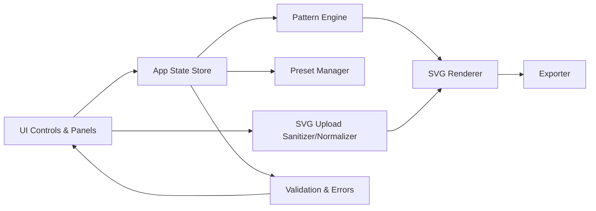
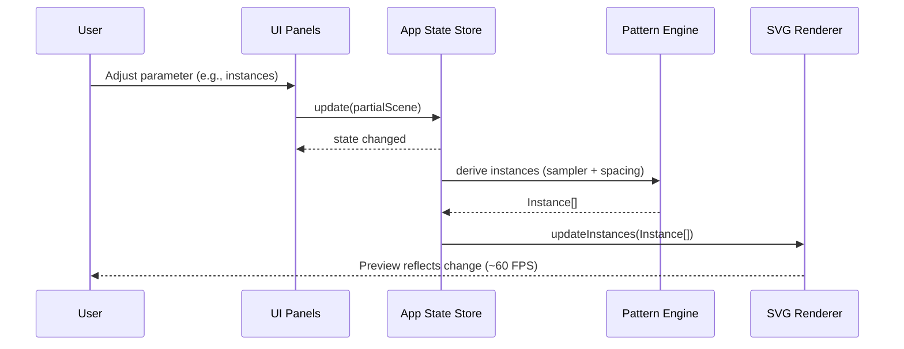
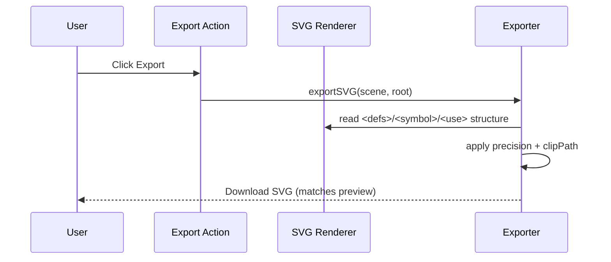
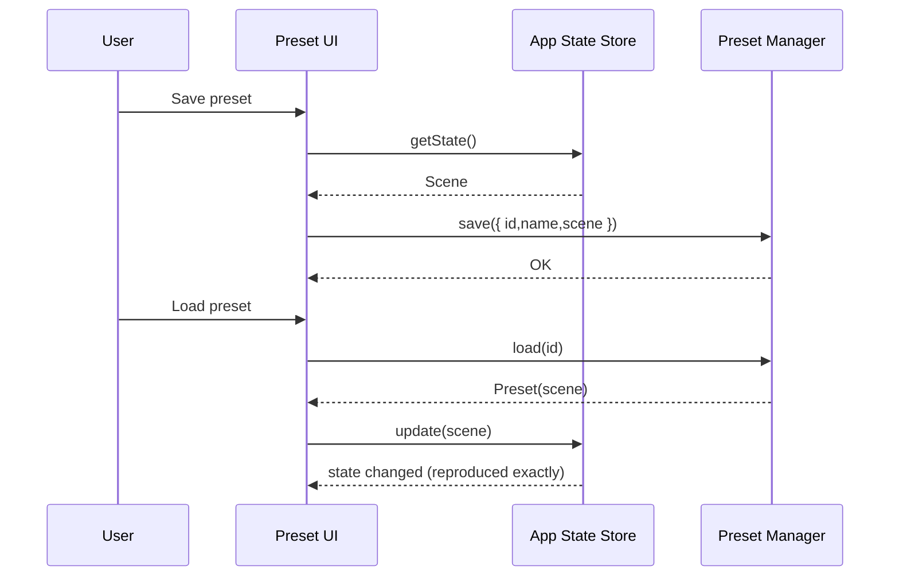
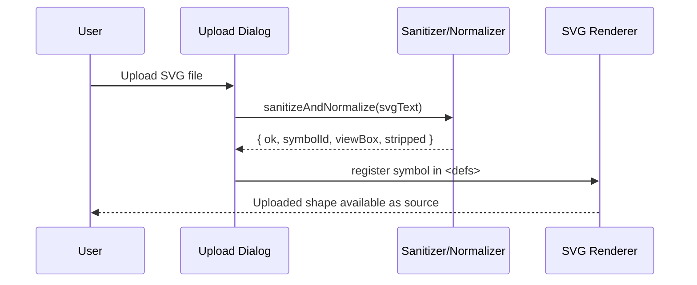
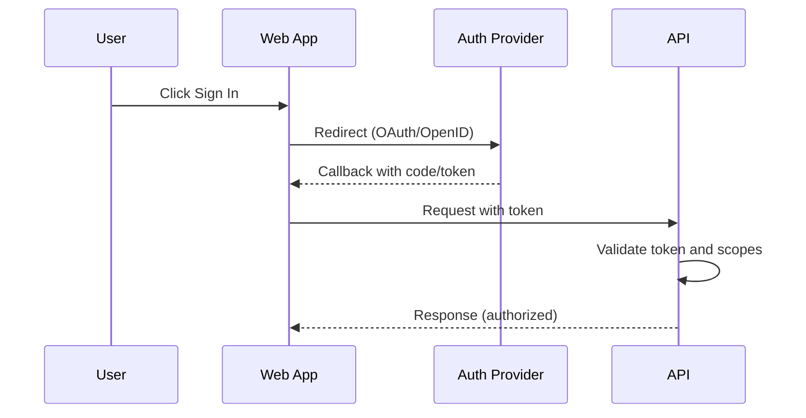
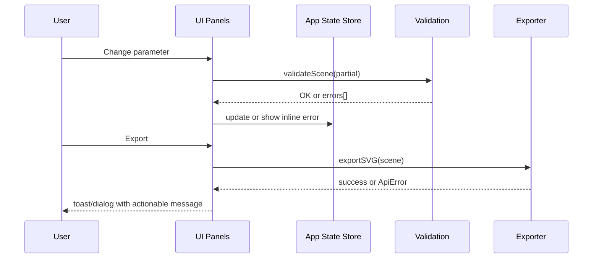

# V-Tool Fullstack Architecture Document

This document outlines the complete fullstack architecture for V-Tool, including backend systems, frontend implementation, and their integration. It serves as the single source of truth for AI-driven development, ensuring consistency across the entire technology stack.

This unified approach combines what would traditionally be separate backend and frontend architecture documents, streamlining the development process for modern fullstack applications where these concerns are increasingly intertwined. For V-Tool’s MVP, the system is intentionally client-only with static hosting; backend services are deferred unless the roadmap later introduces sharing, analytics, or preset sync.

## Starter Template or Existing Project

N/A — Greenfield project.

Notes:
- PRD targets a pure-SVG, client-only MVP with static hosting (Vercel/Netlify/GitHub Pages).
- Suitable starters if desired (choose one):
  - Vite + Svelte (lightweight, great DX, strong SVG ergonomics)
  - Vite + React + TypeScript (ubiquitous ecosystem, easy hiring)
  - Next.js (App Router) deployed as static export (if planning future server features)
- Decision pending user preference; this doc will adapt accordingly.

## Change Log

| Date       | Version | Description                   | Author  |
|------------|---------|-------------------------------|---------|
| 2025-10-29 | v0.2    | Added view state, orthographic depth semantics, JSON schema updates | Winston |
| 2025-10-29 | v0.1    | Initial architecture draft    | Winston |

## High Level Architecture

### Technical Summary
V-Tool MVP is a client-only, static web application focused on a pure-SVG rendering pipeline to guarantee WYSIWYG preview/export parity. The frontend is implemented as a single-page application (SPA) using a modern framework with TypeScript and modular packages separating the SVG engine, samplers/transforms, renderer, presets, and export. No backend services are required for MVP; all state persists locally (localStorage) including presets and deterministic seeds. Static hosting on a global CDN provides fast delivery and preview deployments, with the option to introduce API services later for sharing, analytics, or preset sync without disrupting the core client architecture. This approach directly meets PRD goals around fidelity, performance, and rapid iteration while minimizing operational complexity and cost.

### Platform and Infrastructure Choice
Options (2–3 viable):
- Vercel (Static SPA)
  - Pros: Excellent DX, preview deployments, global edge CDN, seamless Git integration; easy future path to Edge Functions if needed.
  - Cons: Vendor lock-in concerns (minor for static assets), limited control over low-level CDN settings.
- Netlify (Static SPA)
  - Pros: Strong static hosting and build previews, forms/redirects out of the box; simple setup.
  - Cons: Fewer ecosystem integrations vs Vercel for JS meta-frameworks; similar vendor coupling.
- GitHub Pages (Static SPA)
  - Pros: Free/low-cost, simple for static sites.
  - Cons: Less robust preview workflow, fewer edge features, more manual CI wiring.

Recommendation: Vercel (Static SPA) — confirmed.

Platform record (pending confirmation):
**Platform:** Vercel (Static SPA) — confirmed
**Key Services:** Static hosting, global CDN, preview deployments (optionally Edge Functions later)
**Deployment Host and Regions:** Global edge network; regionless for static assets

### Repository Structure
**Structure:** Monorepo (npm workspaces) recommended for future growth; single-package acceptable for MVP
**Monorepo Tool:** npm workspaces (can add Turborepo later if needed)
**Package Organization:**
- apps/web — SPA (UI, routing, panels)
- packages/engine — core SVG engine (samplers, transforms, RNG)
- packages/shared — shared types/utils (scene schema, presets)
- packages/export (optional later) — export pipeline, precision controls
- packages/ui (optional later) — shared components/styles

### High Level Architecture Diagram
```mermaid
graph TD
  U[User] --> B[Browser (SPA)]
  subgraph Web App (Client Only)
    UI[Controls & Panels] --> ST[App State / Store]
    ST --> ENG[Pattern Engine<br/>(samplers, spacing, transforms)]
    ENG --> REN[SVG Renderer<br/>(<defs>/<symbol>/<use>)]
    REN --> VP[Viewport Overlay<br/>+ clipPath]
    ST --> EXP[SVG Exporter<br/>(precision, clipPath)]
    ST --> PRE[Presets (localStorage)]
    UP[SVG Upload] --> SAN[SVG Sanitizer/Normalizer]
    SAN --> SYM[Symbol Builder]
    SYM --> REN
  end
  CD[CDN + Static Hosting] --- B
  GIT[Git Repo] --> CI[Build]
  CI --> DEP[Deploy]
  DEP --> CD
```

### Architectural Patterns
- Jamstack/Static SPA: Client-only app served from CDN; add APIs later without changing core.
- Component-Based UI with TypeScript: Clear separation of concerns and maintainability.
- Functional Core, Imperative Shell: Deterministic engine logic; side effects at edges (UI, storage, export).
- Unidirectional Data Flow: Centralized state drives renderer/export; improves predictability and testing.
- Deterministic RNG (Seeded): Ensures reproducible scenes across sessions and exports.
 - SVG Symbol Reuse Pattern: Use <defs>/<symbol>/<use> to minimize DOM size and export weight.
- Input Sanitization Pipeline: Strict SVG normalization and script/filter stripping on upload.
 - Orthographic Projection (MVP): 2D view transforms (pan/zoom) only; no perspective/occlusion.

## Tech Stack

The following selections are optimized for a client-only, pure-SVG MVP with fast iteration and minimal ops. Versions are proposed; confirm or adjust and we’ll lock them.

| Category             | Technology                         | Version  | Purpose                                   | Rationale |
|----------------------|------------------------------------|----------|-------------------------------------------|-----------|
| Frontend Language    | TypeScript                         | 5.6.x    | Type safety across engine/UI               | Mature, great tooling, helps prevent regressions |
| Frontend Framework   | None (Vanilla TS + Vite)           | -        | Minimal SPA shell                          | PRD states no framework needed; reduce overhead |
| UI Component Library | Tweakpane                           | 4.x      | Parameter panels and bindings               | Lightweight, focused control panes; great ergonomics for creative tools |
| State Management     | Lightweight custom store (observable) | 0.1     | Centralized app state                      | Unidirectional flow, tiny surface area |
| Backend Language     | N/A (client-only MVP)              | -        | -                                         | No backend per PRD |
| Backend Framework    | N/A (client-only MVP)              | -        | -                                         | - |
| API Style            | None (no API in MVP)               | -        | -                                         | Client-only; can add later |
| Database             | N/A                                 | -        | -                                         | - |
| Cache                | N/A                                 | -        | -                                         | - |
| File Storage         | N/A                                 | -        | -                                         | - |
| Authentication       | N/A                                 | -        | -                                         | - |
| Frontend Testing     | Vitest + Testing Library           | latest   | Unit/component tests                       | Fast DX; aligns with Vite |
| Backend Testing      | N/A                                 | -        | -                                         | - |
| E2E Testing          | Playwright                         | latest   | Browser automation & parity checks         | Reliable cross-browser testing |
| Build Tool           | Vite                                | 5.x      | Dev server and build                       | Fast HMR, optimized build |
| Bundler              | esbuild (dev) + Rollup (prod)      | bundled  | Transform/bundle                            | Vite defaults; proven setup |
| IaC Tool             | None (MVP)                          | -        | -                                         | Static hosting only |
| CI/CD                | GitHub Actions                      | -        | Build + preview + deploy                   | Simple, ubiquitous |
| Monitoring           | Optional: Sentry (frontend)         | latest   | Error tracking (stretch)                   | Useful, but can defer |
| Logging              | Console + structured event logs     | -        | Minimal runtime insights                    | Lightweight for MVP |
| CSS Framework        | Tailwind CSS (optional)             | 3.x      | Quick, consistent UI                       | Speeds panel layout; can omit if desired |

Notes
- If you prefer React or Svelte, we can swap “None” for React 18.x or Svelte 5 and adjust state/testing accordingly.
- If platform is Vercel, CI can be either GitHub Actions or Vercel’s built-in; keeping Actions for portability.

## Data Models

The following conceptual models define the scene, distribution, transforms, styling, viewport, and export concerns. These live in `packages/shared` so both UI and engine can share the types.

### Scene
Purpose: Canonical container for all parameters defining a renderable scene and its export characteristics.

Key Attributes
- id: string — unique scene identifier
- version: string — schema version for migrations
- rng: RNG — deterministic seed source
- shape: ShapeSource — basic or uploaded symbol
- distribution: Distribution — path or particle with subtype
- transform: Transform — depth→scale mapping and rotation settings
- style: Styling — fill/stroke/background
 - view: View — pan/zoom and overlay visibility
- viewport: Viewport — aspect/orientation and base width
- export: ExportSettings — numeric precision and clipping

TypeScript Interface
```ts
export interface Scene {
  id: string;
  version: string;
  rng: RNG;
  shape: ShapeSource;
  distribution: Distribution;
  transform: Transform;
  style: Styling;
  view: View;
  viewport: Viewport;
  export: ExportSettings;
  // lockProfileId?: string; // stretch: parameter locking profile reference
}
```

Relationships
- Aggregates ShapeSource, Distribution, Transform, Styling, Viewport, ExportSettings, and RNG.
- Is embedded inside Preset.

### RNG
Purpose: Deterministic seed management for all randomized parameters.

Key Attributes
- seed: number — master seed controlling samplers and randomization

TypeScript Interface
```ts
export interface RNG {
  seed: number;
}
```

Relationships
- Referenced by Scene; drives randomized placement and rotations.

### ShapeSource
Purpose: Defines the instance geometry source (basic shape or uploaded, normalized SVG symbol).

Key Attributes
- type: 'basic' | 'uploaded'
- shape (when basic): 'square' | 'circle' | 'triangle'
- symbolId (when uploaded): string — id within <defs>
- viewBox (when uploaded): [number, number, number, number]

TypeScript Interface
```ts
export type BasicShape = 'square' | 'circle' | 'triangle';

export type ShapeSource =
  | { type: 'basic'; shape: BasicShape }
  | { type: 'uploaded'; symbolId: string; viewBox: [number, number, number, number] };
```

Relationships
- For uploaded shapes, the symbol is produced by the sanitization/normalization pipeline.

### Distribution
Purpose: Controls instance placement via Path or Particle modes.

Key Attributes
- mode: 'path' | 'particle'
- spacing: 'linear' | 'ease-in' | 'ease-out' (for path)
- Path subtype: 'linear' | 'sine' with frequency/amplitude and instances
- Particle subtype: 'grid' with jitter or 'random' with density

TypeScript Interface
```ts
export type SpacingFn = 'linear' | 'ease-in' | 'ease-out';
export type PathType = 'linear' | 'sine';

export interface PathDistribution {
  mode: 'path';
  path: {
    type: PathType;
    instances: number;     // total instances to place
    frequency?: number;    // for sine
    amplitude?: number;    // for sine
  };
  spacing: SpacingFn;
}

export interface GridJitter {
  type: 'grid';
  density: number; // approx instances per 100x100 units
  jitter: number;  // 0..1
}

export interface RandomScatter {
  type: 'random';
  density: number; // approx instances per 100x100 units
}

export interface ParticleDistribution {
  mode: 'particle';
  particle: GridJitter | RandomScatter;
}

export type Distribution = PathDistribution | ParticleDistribution;
```

Relationships
- Scene selects one Distribution; PathDistribution references a SpacingFn.

### Transform
Purpose: Maps conceptual depth to per-instance scale and handles rotation behavior; controls render order.

Key Attributes
- depthRange: [number, number] — 0..1 logical depth input domain
- scaleRange: [number, number] — output scale range applied by depth
- rotation: fixed or range (min,max); seeded if randomized
- sortByDepth: boolean — ensure visual consistency per PRD

TypeScript Interface
```ts
export interface Transform {
  depthRange: [number, number];
  scaleRange: [number, number];
  rotation: { mode: 'fixed' | 'range'; value?: number; min?: number; max?: number };
  sortByDepth: boolean;
}
```

Relationships
- Applied by the engine during placement and render ordering.

### Projection & Depth Semantics (MVP)
Purpose: Clarify how depth is represented visually without full 3D.

Key Points
- Projection: Orthographic; no camera perspective or occlusion in MVP.
- Depth: Logical depth 0..1 maps to per-instance scale via scaleRange.
- Ordering: sortByDepth enforces visual layering to imply depth.
- Future: True Z positioning with camera transforms is deferred to Phase 2.

### World Space & Origin
Purpose: Define coordinate system and view transforms.

Key Points
- Origin: World origin at (0,0) centered on canvas.
- Units: CSS pixels for simplicity and parity with SVG.
- View Transform: Pan (x,y) and zoom apply as a 2D transform of the world into the viewport; does not alter export cropping.

### Styling
Purpose: Scene-level styling for fill/stroke/background.

Key Attributes
- fill: string (CSS color)
- stroke: string (CSS color)
- strokeWidth: number (px)
- background: string (CSS color)

TypeScript Interface
```ts
export interface Styling {
  fill: string;
  stroke: string;
  strokeWidth: number;
  background: string;
}
```

Relationships
- Consumed by renderer and export pipeline; can be grouped later for optimization (stretch).

### Viewport
Purpose: Fixed export frame with aspect and orientation.

Key Attributes
- aspect: '16:9' | '1:1' | '4:3'
- orientation: 'landscape' | 'portrait'
- width: number (px) — height derived from aspect

TypeScript Interface
```ts
export type AspectRatio = '16:9' | '1:1' | '4:3';
export type Orientation = 'landscape' | 'portrait';

export interface Viewport {
  aspect: AspectRatio;
  orientation: Orientation;
  width: number; // px; height derived from aspect
}
```

Relationships
- Used by renderer overlay and export cropping.

### View (MVP)
Purpose: Canvas view state for 2D navigation and overlay visibility.

Key Attributes
- pan: { x: number, y: number } — world-space offset
- zoom: number — 0.1..10 scale factor
- overlayVisible: boolean — show/hide viewport guides

TypeScript Interface
```ts
export interface View {
  pan: { x: number; y: number };
  zoom: number; // 0.1..10
  overlayVisible: boolean;
}
```

Relationships
- Referenced by Scene; consumed by renderer and UI Canvas Controls.

### ExportSettings
Purpose: Controls precision and cropping to guarantee parity and small output.

Key Attributes
- precision: number — decimal precision for numeric outputs
- useSymbols: true — enforce <defs>/<symbol>/<use>
- clipToViewport: true — apply clipPath to exact viewport bounds

TypeScript Interface
```ts
export interface ExportSettings {
  precision: number;
  useSymbols: true;
  clipToViewport: true;
}
```

Relationships
- Referenced by Scene; used by exporter.

### Preset
Purpose: Persist and reuse complete scenes via local storage.

Key Attributes
- id: string, name: string
- scene: Scene — full scene snapshot (including seed)
- createdAt/updatedAt: ISO strings

TypeScript Interface
```ts
export interface Preset {
  id: string;
  name: string;
  scene: Scene;
  createdAt: string;
  updatedAt?: string;
}
```

Relationships
- Stored/retrieved locally; loading a preset reproduces the scene exactly.

### UploadNormalizationResult (runtime)
Purpose: Reports outcome of SVG sanitization/normalization on upload.

Key Attributes
- ok: boolean, reason?: string
- symbolId?: string, viewBox?: [number, number, number, number]
- stripped: { scripts: boolean; filters: boolean; transformsFlattened: boolean }

TypeScript Interface
```ts
export interface UploadNormalizationResult {
  ok: boolean;
  reason?: string;
  symbolId?: string;
  viewBox?: [number, number, number, number];
  stripped: {
    scripts: boolean;
    filters: boolean;
    transformsFlattened: boolean;
  };
}
```

Relationships
- When ok=true, produces the data to construct a ShapeSource of type 'uploaded'.

## API Specification

N/A — Client-only MVP. No backend API is required per PRD and Tech Stack.

Future extension path (when adding sharing/analytics/preset sync):
- API Style Options: REST (OpenAPI), tRPC, or GraphQL.
- Auth Options: Cookie-based or token-based via managed provider (e.g., Supabase, Auth.js) if later needed.
- Data: Preset meta + user data in a hosted DB; scene JSON stored as documents or blobs.
- Recommendation if/when needed: Start with a minimal REST (OpenAPI) for portability and caching; introduce BFF if a public API emerges.

## Components

### UI Controls & Panels
Responsibility: Parameter editing (object, distribution, transforms, styling, viewport, export, presets).

Key Interfaces
- `onParamChange(partial: Partial<Scene>): void`
- `openUploadDialog(): void`

Dependencies: App State Store, Validation.

Technology Stack: Vanilla TS UI with Tweakpane for controls (optional Tailwind CSS for layout).

### App State Store
Responsibility: Central scene state, undo-friendly updates, and derived selectors.

Key Interfaces
- `getState(): Scene`
- `update(patch: Partial<Scene>): void`
- `subscribe(listener: (s: Scene) => void): () => void`

Dependencies: Shared types, RNG service.

Technology Stack: Lightweight observable store in TypeScript.

### Pattern Engine
Responsibility: Deterministic placement via samplers (path/particle), spacing functions, and transform application.

Key Interfaces
- `samplePath(scene: Scene): Instance[]`
- `sampleParticle(scene: Scene): Instance[]`
- `applyTransforms(instances: Instance[], t: Transform, rng: RNG): Instance[]`

Dependencies: RNG, Distribution types, Transform.

Technology Stack: TypeScript functional core.

### SVG Renderer
Responsibility: Build <defs>/<symbol>/<use> structure, render instances into the scene group, and apply viewport overlay.

Key Interfaces
- `render(scene: Scene, target: SVGSVGElement): void`
- `updateInstances(instances: Instance[]): void`

Dependencies: Symbol Builder, Styling, Viewport.

Technology Stack: DOM/SVG APIs, efficient batching.

### Exporter
Responsibility: Generate precise SVG output mirroring preview; apply clipPath and numeric precision.

Key Interfaces
- `exportSVG(scene: Scene, root: SVGSVGElement): string`

Dependencies: Renderer (structure), ExportSettings, Viewport.

Technology Stack: TypeScript, DOM serialization.

### Preset Manager
Responsibility: Save/load presets to localStorage; ensure deterministic reproduction (includes seed).

Key Interfaces
- `save(preset: Preset): void`
- `load(id: string): Preset | null`
- `list(): Preset[]`

Dependencies: Scene schema, RNG.

Technology Stack: Web Storage API, JSON.

### SVG Upload Sanitizer/Normalizer
Responsibility: Accept single-group/path SVGs; strip scripts/filters; flatten transforms; create symbol.

Key Interfaces
- `sanitizeAndNormalize(svgText: string): UploadNormalizationResult`
- `toSymbol(svg: Document): { symbolId: string; viewBox: [number,number,number,number] }`

Dependencies: DOMParser, sanitizer rules.

Technology Stack: TypeScript, DOM APIs.

### Validation & Error Handling
Responsibility: Parameter validation, user-friendly messages, consistent error format.

Key Interfaces
- `validateScene(scene: Scene): ValidationResult`
- `formatError(e: unknown): ApiError` (shared error shape)

Dependencies: Shared types.

Technology Stack: TypeScript utilities.

### Component Diagram


## External APIs

N/A — No external integrations required for MVP.

Future candidates (post-MVP):
- Analytics SDK (opt-in), palette services, or cloud preset storage API.
- Add only when needed; document auth, rate limits, and security at that time.

## Core Workflows

### 1) Parameter Change → Preview Update


### 2) Export → WYSIWYG SVG


### 3) Presets Save/Load


### 4) SVG Upload Normalization


## Database Schema

MVP uses client-only storage (localStorage). Presenting JSON Schemas for data integrity and future portability.

Scene JSON Schema
```json
{
  "$schema": "https://json-schema.org/draft/2020-12/schema",
  "$id": "https://v-tool.app/schema/scene.schema.json",
  "title": "Scene",
  "type": "object",
  "required": ["id", "version", "rng", "shape", "distribution", "transform", "style", "view", "viewport", "export"],
  "properties": {
    "id": { "type": "string" },
    "version": { "type": "string" },
    "rng": {
      "type": "object",
      "required": ["seed"],
      "properties": { "seed": { "type": "integer" } }
    },
    "shape": {
      "oneOf": [
        {
          "type": "object",
          "required": ["type", "shape"],
          "properties": {
            "type": { "const": "basic" },
            "shape": { "enum": ["square", "circle", "triangle"] }
          }
        },
        {
          "type": "object",
          "required": ["type", "symbolId", "viewBox"],
          "properties": {
            "type": { "const": "uploaded" },
            "symbolId": { "type": "string" },
            "viewBox": {
              "type": "array",
              "items": { "type": "number" },
              "minItems": 4,
              "maxItems": 4
            }
          }
        }
      ]
    },
    "distribution": {
      "oneOf": [
        {
          "type": "object",
          "required": ["mode", "path", "spacing"],
          "properties": {
            "mode": { "const": "path" },
            "spacing": { "enum": ["linear", "ease-in", "ease-out"] },
            "path": {
              "type": "object",
              "required": ["type", "instances"],
              "properties": {
                "type": { "enum": ["linear", "sine"] },
                "instances": { "type": "integer", "minimum": 0 },
                "frequency": { "type": "number" },
                "amplitude": { "type": "number" }
              }
            }
          }
        },
        {
          "type": "object",
          "required": ["mode", "particle"],
          "properties": {
            "mode": { "const": "particle" },
            "particle": {
              "oneOf": [
                {
                  "type": "object",
                  "required": ["type", "density", "jitter"],
                  "properties": {
                    "type": { "const": "grid" },
                    "density": { "type": "number", "minimum": 0 },
                    "jitter": { "type": "number", "minimum": 0, "maximum": 1 }
                  }
                },
                {
                  "type": "object",
                  "required": ["type", "density"],
                  "properties": {
                    "type": { "const": "random" },
                    "density": { "type": "number", "minimum": 0 }
                  }
                }
              ]
            }
          }
        }
      ]
    },
    "transform": {
      "type": "object",
      "required": ["depthRange", "scaleRange", "rotation", "sortByDepth"],
      "properties": {
        "depthRange": { "type": "array", "items": { "type": "number" }, "minItems": 2, "maxItems": 2 },
        "scaleRange": { "type": "array", "items": { "type": "number" }, "minItems": 2, "maxItems": 2 },
        "rotation": {
          "type": "object",
          "required": ["mode"],
          "properties": {
            "mode": { "enum": ["fixed", "range"] },
            "value": { "type": "number" },
            "min": { "type": "number" },
            "max": { "type": "number" }
          }
        },
        "sortByDepth": { "type": "boolean" }
      }
    },
    "style": {
      "type": "object",
      "required": ["fill", "stroke", "strokeWidth", "background"],
      "properties": {
        "fill": { "type": "string" },
        "stroke": { "type": "string" },
        "strokeWidth": { "type": "number", "minimum": 0 },
        "background": { "type": "string" }
      }
    },
    "view": {
      "type": "object",
      "required": ["pan", "zoom", "overlayVisible"],
      "properties": {
        "pan": {
          "type": "object",
          "required": ["x", "y"],
          "properties": {
            "x": { "type": "number" },
            "y": { "type": "number" }
          }
        },
        "zoom": { "type": "number", "minimum": 0.1, "maximum": 10 },
        "overlayVisible": { "type": "boolean" }
      }
    },
    "viewport": {
      "type": "object",
      "required": ["aspect", "orientation", "width"],
      "properties": {
        "aspect": { "enum": ["16:9", "1:1", "4:3"] },
        "orientation": { "enum": ["landscape", "portrait"] },
        "width": { "type": "integer", "minimum": 1 }
      }
    },
    "export": {
      "type": "object",
      "required": ["precision", "useSymbols", "clipToViewport"],
      "properties": {
        "precision": { "type": "integer", "minimum": 0 },
        "useSymbols": { "const": true },
        "clipToViewport": { "const": true }
      }
    }
  }
}
```

Preset JSON Schema
```json
{
  "$schema": "https://json-schema.org/draft/2020-12/schema",
  "$id": "https://v-tool.app/schema/preset.schema.json",
  "title": "Preset",
  "type": "object",
  "required": ["id", "name", "scene", "createdAt"],
  "properties": {
    "id": { "type": "string" },
    "name": { "type": "string" },
    "scene": { "$ref": "scene.schema.json" },
    "createdAt": { "type": "string", "format": "date-time" },
    "updatedAt": { "type": "string", "format": "date-time" }
  }
}
```

## Frontend Architecture

### Component Architecture
Component Organization
```text
apps/web/
  src/
    components/
      panels/
        ObjectPanel.ts
        DistributionPanel.ts
        TransformPanel.ts
        StylingPanel.ts
        ViewportPanel.ts
        ExportPanel.ts
        PresetsPanel.ts
      canvas/
        Canvas.ts
        CanvasControls.ts
        ViewportOverlay.ts
      common/
        Slider.ts
        NumberInput.ts
        ColorInput.ts
        Toggle.ts
    store/
      store.ts
      selectors.ts
      validators.ts
    services/
      presets.ts
      export.ts
      upload.ts
    utils/
      rng.ts
      svg.ts
    main.ts
```

Component Template
```ts
// apps/web/src/components/panels/DistributionPanel.ts
import { Pane } from 'tweakpane';
import { getState, update, subscribe } from "../../store/store";
import type { Distribution } from "@shared/types";

export function DistributionPanel(root: HTMLElement) {
  const pane = new Pane({ container: root, title: 'Distribution' });
  const state = getState();

  const params = {
    instances: state.distribution.mode === 'path' ? state.distribution.path.instances : 100,
    spacing: state.distribution.mode === 'path' ? state.distribution.spacing : 'linear',
  } as { instances: number; spacing: 'linear'|'ease-in'|'ease-out' };

  pane.addBinding(params, 'instances', { min: 0, step: 1, label: 'Instances' }).on('change', (ev) => {
    if (getState().distribution.mode === 'path') {
      const d = getState().distribution as Extract<Distribution, { mode: 'path' }>;
      update({ distribution: { ...d, path: { ...d.path, instances: Math.max(0, Math.floor(ev.value)) } } as Distribution });
    }
  });

  pane.addBinding(params, 'spacing', { options: { Linear: 'linear', 'Ease In': 'ease-in', 'Ease Out': 'ease-out' } }).on('change', (ev) => {
    if (getState().distribution.mode === 'path') {
      const d = getState().distribution as Extract<Distribution, { mode: 'path' }>;
      update({ distribution: { ...d, spacing: ev.value } as Distribution });
    }
  });

  const unsub = subscribe(() => {
    // reflect external changes if needed
  });
  return () => { unsub(); pane.dispose(); };
}
```

### State Management Architecture
State Structure
```ts
// apps/web/src/store/store.ts
import type { Scene } from "@shared/types";

let scene: Scene;
const listeners = new Set<(s: Scene) => void>();

export function init(initial: Scene) {
  scene = initial;
}

export function getState(): Scene {
  return scene;
}

export function update(patch: Partial<Scene>) {
  scene = { ...scene, ...patch };
  listeners.forEach((l) => l(scene));
}

export function subscribe(l: (s: Scene) => void) {
  listeners.add(l);
  return () => listeners.delete(l);
}
```

State Management Patterns
- Single source of truth (Scene) with pure selectors for derived data
- Immutable updates via shallow merges; avoid in-place mutation
- Evented subscriptions for rendering and side effects
- Deterministic RNG seeded in Scene; derive per-frame RNG streams from master seed
- Optional undo stack for UX polish (stretch)

### Routing Architecture
Route Organization
```text
apps/web/
  src/
    main.ts   # single-view SPA; optional hash routes later
```

Protected Route Pattern
```ts
// N/A in MVP (no auth). Example stub for future use:
export function requireAuth<T extends (...args: any[]) => any>(fn: T): T {
  return (((...args: any[]) => {
    // if (!isAuthenticated()) redirectToLogin(); else fn(...args)
    return fn(...args);
  }) as unknown) as T;
}
```

### Frontend Services Layer
API Client Setup
```ts
// apps/web/src/services/apiClient.ts
// MVP client-only; placeholder for future server calls
export async function get<T>(url: string, init?: RequestInit): Promise<T> {
  const res = await fetch(url, { ...init, method: "GET" });
  if (!res.ok) throw new Error(`GET ${url} -> ${res.status}`);
  return (await res.json()) as T;
}
```

Service Example
```ts
// apps/web/src/services/presets.ts
import type { Preset } from "@shared/types";

const KEY = "vtool.presets";

export function list(): Preset[] {
  try {
    return JSON.parse(localStorage.getItem(KEY) || "[]");
  } catch {
    return [];
  }
}

export function save(preset: Preset) {
  const all = list();
  const idx = all.findIndex((p) => p.id === preset.id);
  if (idx >= 0) all[idx] = preset; else all.push(preset);
  localStorage.setItem(KEY, JSON.stringify(all));
}

export function load(id: string): Preset | null {
  return list().find((p) => p.id === id) || null;
}
```

Tweakpane Integration Notes
- Use a single Pane per panel to organize folders by feature (Object, Distribution, Transform, Styling, Viewport, Export, Presets).
- Bindings should update central state through `update(patch)` only; never mutate state objects directly.
- For performance, debounce rapid slider updates when they cause heavy instance re-sampling, or apply rAF batching in the renderer.

## Backend Architecture

MVP: N/A (client-only). This section documents future-ready patterns if backend features are added.

### Service Architecture

Serverless (future option)
Function Organization
```text
apps/api/            # optional package if backend added later
  functions/
    presets/index.ts
    share/index.ts
  lib/
    repositories/
    auth/
    schema/
```

Function Template (edge-style)
```ts
// apps/api/functions/presets/index.ts
export default async function handler(req: Request): Promise<Response> {
  if (req.method !== 'GET') return new Response('Method Not Allowed', { status: 405 });
  return new Response(JSON.stringify({ ok: true }), {
    headers: { 'content-type': 'application/json' },
  });
}
```

Traditional server (future option)
Controller/Route Organization
```text
apps/api/src/
  routes/
    presets.routes.ts
    health.routes.ts
  services/
  middleware/
  index.ts
```

Controller Template (Express)
```ts
// apps/api/src/routes/health.routes.ts
import { Router } from 'express';
const router = Router();
router.get('/health', (_req, res) => res.json({ ok: true }));
export default router;
```

### Database Architecture
Schema Design
- See Database Schema section (JSON Schema for Scene and Preset). If/when a DB is introduced, mirror these shapes.

Data Access Layer (Repository Pattern)
```ts
// apps/api/src/repositories/presets.ts
import type { Preset } from '@shared/types';

export interface PresetRepository {
  save(p: Preset): Promise<void>;
  findById(id: string): Promise<Preset | null>;
  listByUser(userId: string): Promise<Preset[]>;
}

export class InMemoryPresetRepo implements PresetRepository {
  private data = new Map<string, Preset>();
  async save(p: Preset) { this.data.set(p.id, p); }
  async findById(id: string) { return this.data.get(id) || null; }
  async listByUser(_userId: string) { return [...this.data.values()]; }
}
```

### Authentication and Authorization

Auth Flow (future example)


Middleware/Guards (Express example)
```ts
// apps/api/src/middleware/requireAuth.ts
import type { Request, Response, NextFunction } from 'express';

export function requireAuth(req: Request, res: Response, next: NextFunction) {
  const token = req.headers.authorization?.replace(/^Bearer\s+/i, '');
  if (!token) {
    return res.status(401).json({ error: { code: 'UNAUTHENTICATED', message: 'Missing token', requestId: crypto.randomUUID(), timestamp: new Date().toISOString() } });
  }
  // TODO: verify token
  return next();
}
```

## Unified Project Structure

```text
v-tool/
  .github/
    workflows/
      ci.yml
      deploy.yml
  apps/
    web/
      src/
        components/
        store/
        services/
        utils/
        main.ts
      index.html
      vite.config.ts
      tsconfig.json
      package.json
    api/                 # optional, future serverless/server app
      src/               # or functions/ for serverless
      package.json
  packages/
    engine/
      src/
      package.json
    shared/
      src/
        types.ts
      package.json
    export/              # optional later
      src/
      package.json
    ui/                  # optional later
      src/
      package.json
  package.json           # workspaces root
  tsconfig.base.json
  README.md
```

Notes
- Start with `apps/web` and `packages/shared`; add `engine` as the core grows, then extract as needed.
- Keep shared types in `packages/shared` to prevent drift and circular deps.
- Optional Turborepo can be added later for pipelines/caching.

## CI/CD

Pipeline
- CI: Install, type-check, lint, unit tests, build (Vite) on PRs.
- E2E: Playwright smoke on main on demand (or nightly).
- Deploy: On main merge → Vercel static deploy (or Netlify). Previews on PRs.

Example GitHub Actions (ci.yml)
```yaml
name: CI
on: [push, pull_request]
jobs:
  build:
    runs-on: ubuntu-latest
    steps:
      - uses: actions/checkout@v4
      - uses: actions/setup-node@v4
        with: { node-version: '20' }
      - run: npm ci
      - run: npm run typecheck --workspaces
      - run: npm run lint --workspaces || true
      - run: npm test --workspaces --if-present
      - run: npm run -w apps/web build
```

## Testing Strategy

Test Pyramid
```text
          E2E Tests
         /        \
    Integration   Component/Unit
```

Test Organization
```text
apps/web/
  tests/            # component tests (Vitest + Testing Library)
  e2e/              # Playwright tests
packages/engine/
  tests/            # pure function/unit tests
```

Frontend Component Test (example)
```ts
import { describe, it, expect } from 'vitest';
import { DistributionPanel } from '../src/components/panels/DistributionPanel';

describe('DistributionPanel', () => {
  it('updates instances without negative values', () => {
    const root = document.createElement('div');
    root.innerHTML = '<input id="instances" />';
    DistributionPanel(root);
    const input = root.querySelector('#instances') as HTMLInputElement;
    input.value = '-5';
    input.dispatchEvent(new Event('input'));
    expect(Number(input.value)).toBe(0);
  });
});
```

Engine Unit Test (example)
```ts
import { describe, it, expect } from 'vitest';
import { samplePath } from '../src/engine';
import type { Scene } from '@shared/types';

it('produces deterministic instances for same seed', () => {
  const s1: Scene = /* ... */ {} as any;
  const s2: Scene = /* same values with same seed */ {} as any;
  expect(samplePath(s1)).toEqual(samplePath(s2));
});
```

E2E Test (export parity smoke)
```ts
import { test, expect } from '@playwright/test';
test('export matches preview size and structure', async ({ page }) => {
  await page.goto('/');
  // tweak params
  await page.getByLabel('Instances').fill('100');
  // trigger export and compare basic invariants
  const svgText = await page.evaluate(() => window.__debugExport());
  expect(svgText).toContain('<clipPath');
  expect(svgText).toContain('<symbol');
});
```

## Coding Standards

Critical Fullstack Rules
- Type Sharing: Define all domain types in `packages/shared` and import from there.
- Services Only: UI never calls fetch directly; use services layer.
- Env Access: Access environment via a config module; no direct `process.env`.
- Error Shape: Use the shared `ApiError` shape consistently in UI and (future) API.
- State Updates: Never mutate state in place; use `update(patch)` with immutable merges.

Naming Conventions
- Components: PascalCase — `ObjectPanel.ts`
- Hooks/Helpers: camelCase — `useRng.ts`, `formatError.ts`
- API Routes (future): kebab-case — `/api/preset-share`
- Local Storage Keys: dot.notation — `vtool.presets`

## Error Handling Strategy

Error Flow


Error Response Format (shared)
```ts
export interface ApiError {
  error: {
    code: string;
    message: string;
    details?: Record<string, any>;
    timestamp: string;
    requestId: string;
  };
}
```

Frontend Error Handling (example)
```ts
export function formatError(e: unknown): string {
  if (typeof e === 'string') return e;
  if (e && typeof e === 'object' && 'error' in e) {
    const err = (e as any).error;
    return `${err.code}: ${err.message}`;
  }
  return 'Unexpected error. Please try again.';
}
```

Backend Error Handling (future Express example)
```ts
// apps/api/src/middleware/errorHandler.ts
import type { Request, Response, NextFunction } from 'express';
export function errorHandler(err: any, _req: Request, res: Response, _next: NextFunction) {
  const payload = {
    error: {
      code: err.code || 'INTERNAL',
      message: err.message || 'Internal Server Error',
      details: err.details || undefined,
      timestamp: new Date().toISOString(),
      requestId: crypto.randomUUID(),
    },
  };
  res.status(err.status || 500).json(payload);
}
```

## Monitoring and Observability

Monitoring Stack
- Frontend Monitoring: Optional Sentry SDK for error tracking (post-MVP)
- Performance Monitoring: Core Web Vitals via `web-vitals` with console or lightweight analytics (opt-in)
- Logging: Structured console logs during development; no PII

Key Metrics
- Core Web Vitals (LCP/CLS/INP)
- JavaScript errors rate
- Export latency (preview→SVG generation)
- Instance count vs FPS during interaction

## Checklist Results Report

Pending. After your confirmation, we can run the Architect checklist and populate results here.
