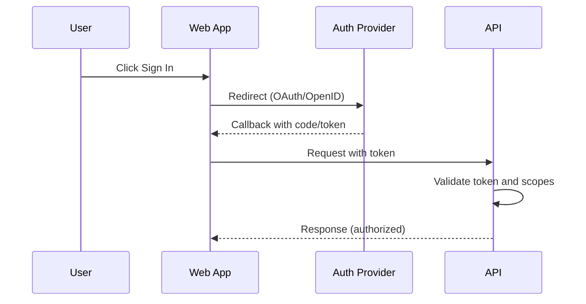

# Backend Architecture

MVP: N/A (client-only). This section documents future-ready patterns if backend features are added.

## Service Architecture

Serverless (future option)
Function Organization
```text
apps/api/            # optional package if backend added later
  functions/
    presets/index.ts
    share/index.ts
  lib/
    repositories/
    auth/
    schema/
```

Function Template (edge-style)
```ts
// apps/api/functions/presets/index.ts
export default async function handler(req: Request): Promise<Response> {
  if (req.method !== 'GET') return new Response('Method Not Allowed', { status: 405 });
  return new Response(JSON.stringify({ ok: true }), {
    headers: { 'content-type': 'application/json' },
  });
}
```

Traditional server (future option)
Controller/Route Organization
```text
apps/api/src/
  routes/
    presets.routes.ts
    health.routes.ts
  services/
  middleware/
  index.ts
```

Controller Template (Express)
```ts
// apps/api/src/routes/health.routes.ts
import { Router } from 'express';
const router = Router();
router.get('/health', (_req, res) => res.json({ ok: true }));
export default router;
```

## Database Architecture
Schema Design
- See Database Schema section (JSON Schema for Scene and Preset). If/when a DB is introduced, mirror these shapes.

Data Access Layer (Repository Pattern)
```ts
// apps/api/src/repositories/presets.ts
import type { Preset } from '@shared/types';

export interface PresetRepository {
  save(p: Preset): Promise<void>;
  findById(id: string): Promise<Preset | null>;
  listByUser(userId: string): Promise<Preset[]>;
}

export class InMemoryPresetRepo implements PresetRepository {
  private data = new Map<string, Preset>();
  async save(p: Preset) { this.data.set(p.id, p); }
  async findById(id: string) { return this.data.get(id) || null; }
  async listByUser(_userId: string) { return [...this.data.values()]; }
}
```

## Authentication and Authorization

Auth Flow (future example)


Middleware/Guards (Express example)
```ts
// apps/api/src/middleware/requireAuth.ts
import type { Request, Response, NextFunction } from 'express';

export function requireAuth(req: Request, res: Response, next: NextFunction) {
  const token = req.headers.authorization?.replace(/^Bearer\s+/i, '');
  if (!token) {
    return res.status(401).json({ error: { code: 'UNAUTHENTICATED', message: 'Missing token', requestId: crypto.randomUUID(), timestamp: new Date().toISOString() } });
  }
  // TODO: verify token
  return next();
}
```
