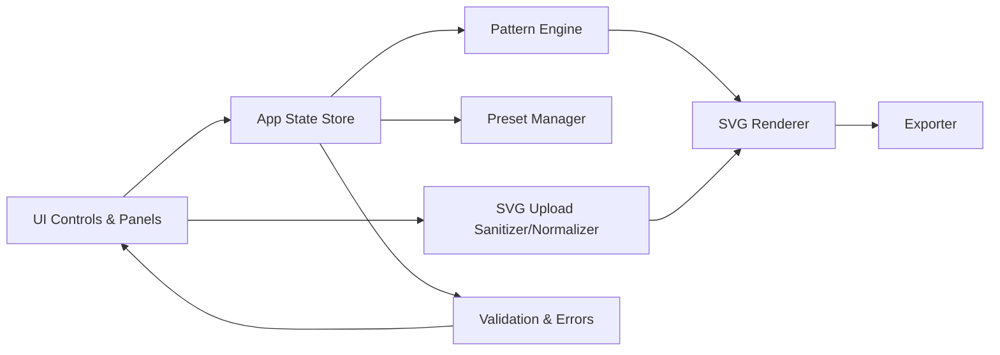

# Components

## UI Controls & Panels
Responsibility: Parameter editing (object, distribution, transforms, styling, viewport, export, presets).

Key Interfaces
- `onParamChange(partial: Partial<Scene>): void`
- `openUploadDialog(): void`

Dependencies: App State Store, Validation.

Technology Stack: Vanilla TS UI with Tweakpane for controls (optional Tailwind CSS for layout).

## App State Store
Responsibility: Central scene state, undo-friendly updates, and derived selectors.

Key Interfaces
- `getState(): Scene`
- `update(patch: Partial<Scene>): void`
- `subscribe(listener: (s: Scene) => void): () => void`

Dependencies: Shared types, RNG service.

Technology Stack: Lightweight observable store in TypeScript.

## Pattern Engine
Responsibility: Deterministic placement via samplers (path/particle), spacing functions, and transform application.

Key Interfaces
- `samplePath(scene: Scene): Instance[]`
- `sampleParticle(scene: Scene): Instance[]`
- `applyTransforms(instances: Instance[], t: Transform, rng: RNG): Instance[]`

Dependencies: RNG, Distribution types, Transform.

Technology Stack: TypeScript functional core.

## SVG Renderer
Responsibility: Build <defs>/<symbol>/<use> structure, render instances into the scene group, and apply viewport overlay.

Key Interfaces
- `render(scene: Scene, target: SVGSVGElement): void`
- `updateInstances(instances: Instance[]): void`

Dependencies: Symbol Builder, Styling, Viewport.

Technology Stack: DOM/SVG APIs, efficient batching.

## Exporter
Responsibility: Generate precise SVG output mirroring preview; apply clipPath and numeric precision.

Key Interfaces
- `exportSVG(scene: Scene, root: SVGSVGElement): string`

Dependencies: Renderer (structure), ExportSettings, Viewport.

Technology Stack: TypeScript, DOM serialization.

## Preset Manager
Responsibility: Save/load presets to localStorage; ensure deterministic reproduction (includes seed).

Key Interfaces
- `save(preset: Preset): void`
- `load(id: string): Preset | null`
- `list(): Preset[]`

Dependencies: Scene schema, RNG.

Technology Stack: Web Storage API, JSON.

## SVG Upload Sanitizer/Normalizer
Responsibility: Accept single-group/path SVGs; strip scripts/filters; flatten transforms; create symbol.

Key Interfaces
- `sanitizeAndNormalize(svgText: string): UploadNormalizationResult`
- `toSymbol(svg: Document): { symbolId: string; viewBox: [number,number,number,number] }`

Dependencies: DOMParser, sanitizer rules.

Technology Stack: TypeScript, DOM APIs.

## Validation & Error Handling
Responsibility: Parameter validation, user-friendly messages, consistent error format.

Key Interfaces
- `validateScene(scene: Scene): ValidationResult`
- `formatError(e: unknown): ApiError` (shared error shape)

Dependencies: Shared types.

Technology Stack: TypeScript utilities.

## Component Diagram

