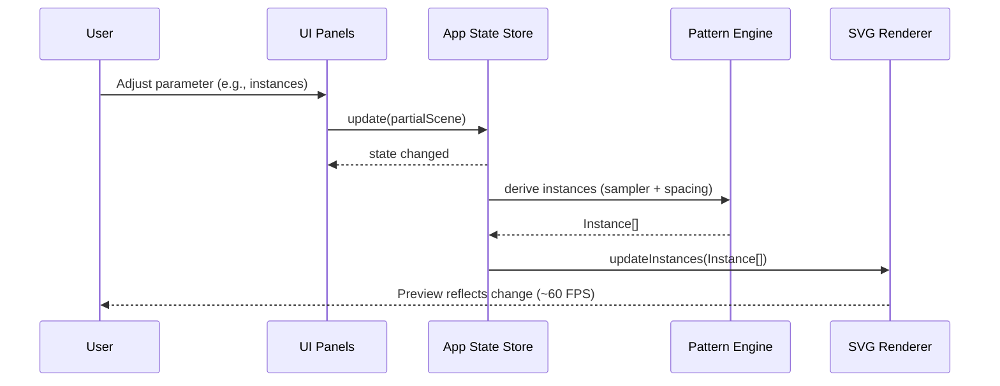
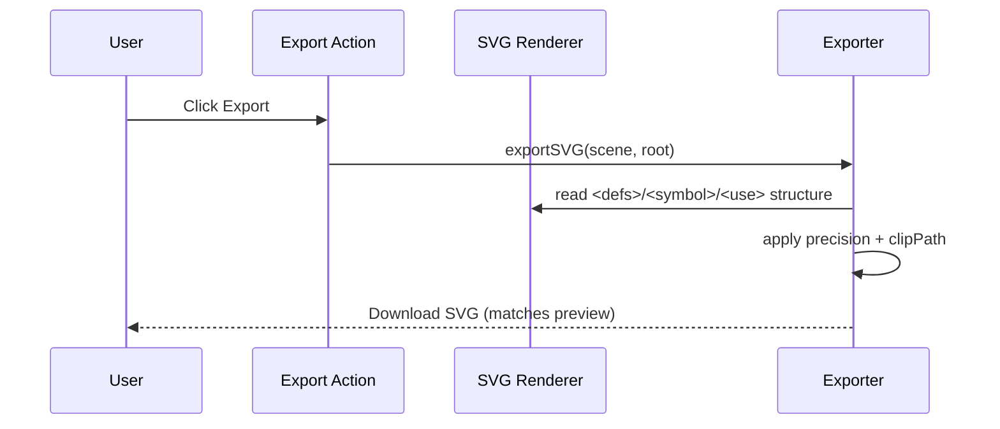
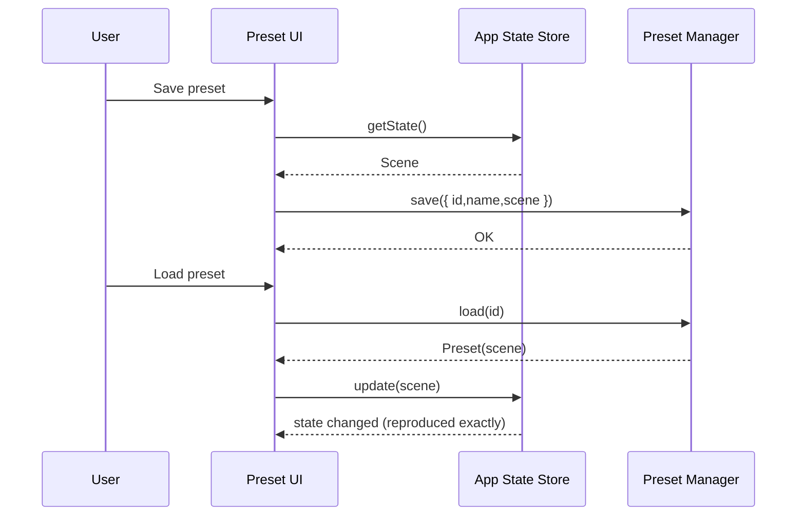
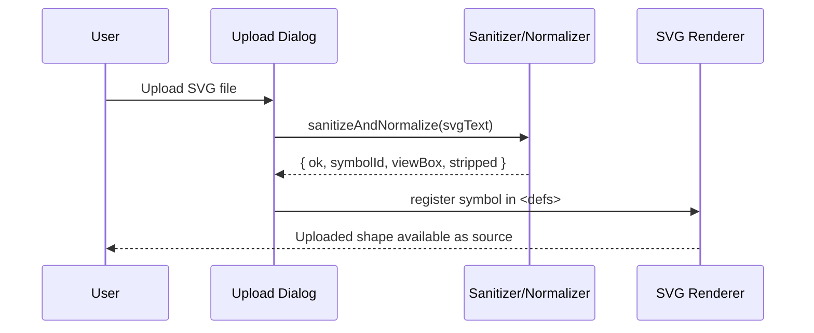

# Core Workflows

## 1) Parameter Change → Preview Update

```mermaid
sequenceDiagram
  participant User
  participant Panels as UI Panels
  participant Store as App State Store
  participant Engine as Pattern Engine
  participant Renderer as SVG Renderer

  User->>Panels: Adjust parameter (e.g., instances)
  Panels->>Store: update(partialScene)
  Store-->>Panels: state changed
  Store->>Engine: derive instances (sampler + spacing)
  Engine-->>Store: Instance[]
  Store->>Renderer: updateInstances(Instance[])
  Renderer-->>User: Preview reflects change (~60 FPS)
```

## 2) Export → WYSIWYG SVG

```mermaid
sequenceDiagram
  participant User
  participant Panels as Export Action
  participant Renderer as SVG Renderer
  participant Exporter as Exporter

  User->>Panels: Click Export
  Panels->>Exporter: exportSVG(scene, root)
  Exporter->>Renderer: read <defs>/<symbol>/<use> structure
  Exporter->>Exporter: apply precision + clipPath
  Exporter-->>User: Download SVG (matches preview)
```

## 3) Presets Save/Load

```mermaid
sequenceDiagram
  participant User
  participant Panels as Preset UI
  participant Store as App State Store
  participant Presets as Preset Manager

  User->>Panels: Save preset
  Panels->>Store: getState()
  Store-->>Panels: Scene
  Panels->>Presets: save({ id,name,scene })
  Presets-->>Panels: OK
  User->>Panels: Load preset
  Panels->>Presets: load(id)
  Presets-->>Panels: Preset(scene)
  Panels->>Store: update(scene)
  Store-->>Panels: state changed (reproduced exactly)
```

## 4) SVG Upload Normalization

```mermaid
sequenceDiagram
  participant User
  participant Panels as Upload Dialog
  participant Normalizer as Sanitizer/Normalizer
  participant Renderer as SVG Renderer

  User->>Panels: Upload SVG file
  Panels->>Normalizer: sanitizeAndNormalize(svgText)
  Normalizer-->>Panels: { ok, symbolId, viewBox, stripped }
  Panels->>Renderer: register symbol in <defs>
  Renderer-->>User: Uploaded shape available as source
```
