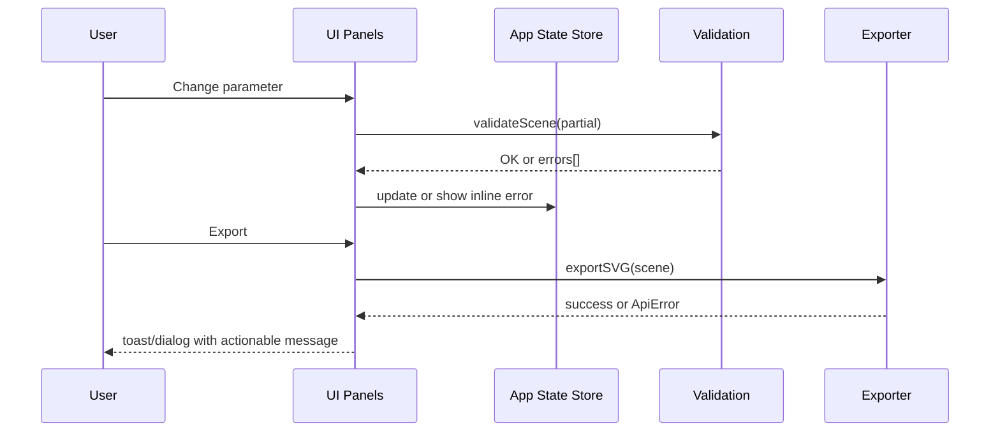

# Error Handling Strategy

Error Flow


Error Response Format (shared)
```ts
export interface ApiError {
  error: {
    code: string;
    message: string;
    details?: Record<string, any>;
    timestamp: string;
    requestId: string;
  };
}
```

Frontend Error Handling (example)
```ts
export function formatError(e: unknown): string {
  if (typeof e === 'string') return e;
  if (e && typeof e === 'object' && 'error' in e) {
    const err = (e as any).error;
    return `${err.code}: ${err.message}`;
  }
  return 'Unexpected error. Please try again.';
}
```

Backend Error Handling (future Express example)
```ts
// apps/api/src/middleware/errorHandler.ts
import type { Request, Response, NextFunction } from 'express';
export function errorHandler(err: any, _req: Request, res: Response, _next: NextFunction) {
  const payload = {
    error: {
      code: err.code || 'INTERNAL',
      message: err.message || 'Internal Server Error',
      details: err.details || undefined,
      timestamp: new Date().toISOString(),
      requestId: crypto.randomUUID(),
    },
  };
  res.status(err.status || 500).json(payload);
}
```
