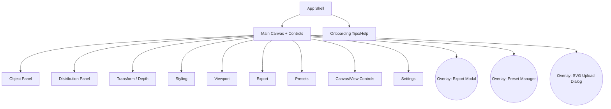
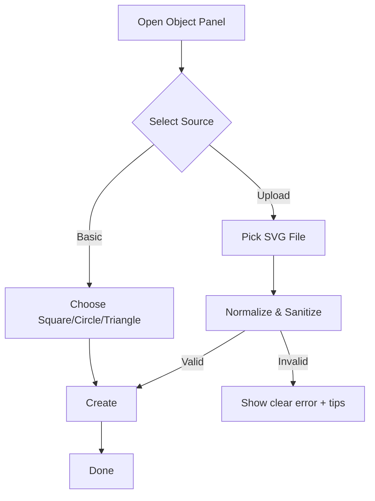
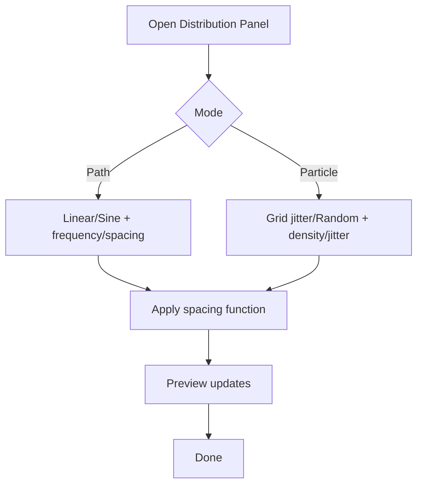
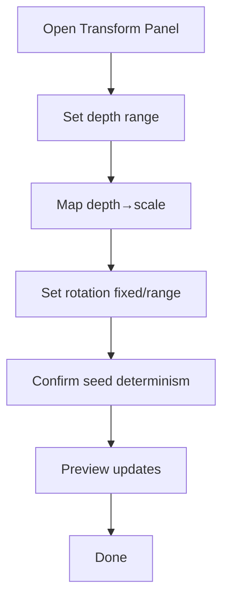
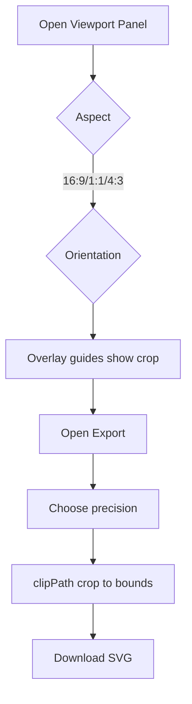
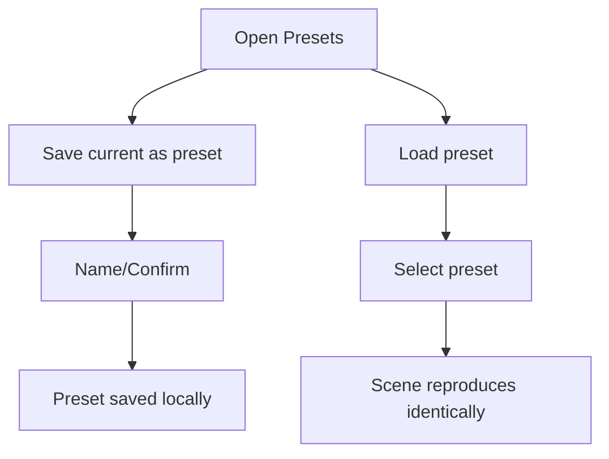

# V‑Tool UI/UX Specification

Status: Draft v0.2
Owner: UX
Source Inputs: docs/brief.md, docs/prd.md

## Introduction
This document defines the user experience goals, information architecture, user flows, and visual design specifications for V‑Tool’s user interface. It serves as the foundation for visual design and frontend development, ensuring a cohesive and user‑centered experience.

### Overall UX Goals & Principles

#### Target User Personas
- Creative Designer: Visual designers/illustrators exploring vector patterns for branding and print/web.
- Creative Coder: Technically minded users who value deterministic seeds and parametric control.
- Brand Steward: Brand/marketing roles validating outputs within constraints and presets.

#### Usability Goals
- Time‑to‑first‑export under 2 minutes for new users.
- WYSIWYG parity: Export visually matches preview inside the viewport.
- 60 FPS during typical interactions up to ~5k instances on desktop.
- Deterministic reproduction: Same seed + params → identical layout.
- Minimal cleanup: >80% of exports require zero edits downstream.

#### Design Principles
1. Clarity over cleverness: Prioritize legible controls and immediate comprehension.
2. Progressive disclosure: Show advanced options on demand; keep defaults simple.
3. Consistency of patterns: Uniform control styles, spacing, and interaction feedback.
4. Immediate feedback: Every change updates the preview in real time.
5. Vector‑first parity: Design and export pipelines must match visually.
6. Accessible by default: Meet WCAG AA for contrast, focus, and keyboard use.

### Change Log
| Date       | Version | Description                            | Author |
|------------|---------|----------------------------------------|--------|
| 2025-10-29 | v0.2    | Added Canvas View Controls (pan/zoom, overlay toggle) and updated IA | Sally  |
| 2025-10-29 | v0.1    | Initial UX spec draft from PRD/brief   | Sally  |

## Information Architecture (IA)

### Site Map / Screen Inventory


### Navigation Structure
- Primary Navigation: Single‑page app shell with persistent right sidebar for panels and a top bar for project actions (seed, preset quick actions, help).
- Secondary Navigation: Within each panel, use tabs or collapsible groups to reveal advanced controls (progressive disclosure).
- Breadcrumb Strategy: Not applicable; shallow SPA with modal overlays.

## User Flows

### Canvas View Controls (Pan/Zoom, Overlay Toggle)
**User Goal:** Reposition and scale the canvas view to compose within the fixed viewport and preview unobstructed when needed.

**Entry Points:** Canvas (drag/wheel), View/Canvas panel, top bar quick actions.

**Success Criteria:** Pan/zoom feel responsive; “Fit to Viewport” centers/scales content; overlay toggle hides/shows crop guides; export unaffected by view transforms.

Flow Diagram
```mermaid
graph TD
  S[Interact with Canvas/View Controls] --> P[Pan (drag or X/Y inputs)]
  S --> Z[Zoom (wheel or slider 0.1x–10x)]
  S --> F[Fit to Viewport]
  S --> T[Toggle Overlay]
  P --> R[Preview updates]
  Z --> R
  F --> R
  T --> R
  R --> D[Done]
```

Edge Cases & Errors
- Excessive zoom → clamp to 0.1×–10×; show snap at 1.0×.
- Large pan offsets → allow freely; provide quick “Reset View”.
- Overlay hidden → show subtle indicator and shortcut to re‑enable.

### Object Selection & Upload
**User Goal:** Choose a basic shape or upload a simple SVG and see it used as the instance source.

**Entry Points:** Object panel; Upload button in Object panel.

**Success Criteria:** Shape updates instantly; complex uploads are rejected with clear reasons and guidance.

Flow Diagram


Edge Cases & Errors
- Uploaded file includes scripts/filters → reject with explanation and link to “What’s supported”.
- Nested transforms too complex to flatten → reject and suggest simplification.
- Empty/too small viewBox → warn and auto‑fit or request correction.

Notes: Show a tiny thumbnail of the active symbol in the Object panel header.

### Distribution Tuning (Path/Particle)
**User Goal:** Configure placement via Linear/Sine (Path) or Grid Jitter/Random (Particle).

**Entry Points:** Distribution panel.

**Success Criteria:** Layout updates smoothly at 60 FPS; parameters are deterministic with a seed.

Flow Diagram


Edge Cases & Errors
- Extreme counts cause slowdown → show “Preview density” toggle when threshold exceeded.
- Invalid numeric ranges → clamp with inline validation and clear messages.

Notes: Group related controls; show short helper text under advanced toggles.

### Depth→Scale and Rotation
**User Goal:** Add depth‑mapped scaling and rotation (fixed or seeded range).

**Entry Points:** Transform/Depth panel.

**Success Criteria:** Visual depth is clear; render order remains consistent relative to depth.

Flow Diagram


Edge Cases & Errors
- Rotation range too wide → warn about visual noise; suggest narrower range.
- Depth scaling hides tiny instances → show min scale guard.

### Viewport & Export
**User Goal:** Set aspect/orientation and export a clean SVG matching the preview.

**Entry Points:** Viewport panel; Export button.

**Success Criteria:** Export file size typically <150KB at default precision; visual parity confirmed.

Flow Diagram


Edge Cases & Errors
- High precision values bloat file size → show estimated size tip.
- Export differs from preview due to units/transforms → block export and show remediation.

### Presets & Seeded Reproducibility
**User Goal:** Save/load presets and reproduce scenes exactly using seeds.

**Entry Points:** Presets panel and header quick actions.

**Success Criteria:** Reloading a preset reproduces the scene identically, including seed.

Flow Diagram


Edge Cases & Errors
- Local storage full → show guidance to delete older presets.
- Version mismatch after upgrades → show migration note or compatibility warning.

## Wireframes & Mockups

**Primary Design Files:** TBD (Figma link to be added)

### Key Screen Layouts

#### Main Canvas & Controls
**Purpose:** Primary workspace for configuring and previewing the pattern.

**Key Elements:**
- Top bar: seed input, preset quick menu, export button, help.
- Right sidebar: panels (Object, Distribution, Transform/Depth, Styling, Viewport, Export, Presets, Settings).
- Main area: SVG canvas with fixed viewport overlay and clear crop guides.
- Canvas view controls: pan (drag or inputs), zoom (wheel/slider), overlay toggle, “Fit to Viewport”, “Reset View”.
- Status/footer: instance count, FPS indicator (optional), parity status.

**Interaction Notes:** Real‑time updates on control change; keyboard focus management; responsive resizing.

**Design File Reference:** TBD

#### Export Modal
**Purpose:** Confirm precision and parity; initiate download.

**Key Elements:**
- Precision slider with recommended default and size estimate.
- Preview parity note and link to known limitations.
- Download button; Cancel.

**Interaction Notes:** Non‑blocking; restores previous focus on close.

**Design File Reference:** TBD

#### Preset Manager
**Purpose:** Save, load, rename, and delete presets.

**Key Elements:**
- List with timestamps; search/filter.
- Actions: load, rename, delete.

**Interaction Notes:** Confirm destructive actions; show seed in details.

**Design File Reference:** TBD

## Component Library / Design System

**Design System Approach:** Minimal custom system for MVP, aligned to an 8‑pt spacing scale; can adopt a formal system later.

### Core Components

#### Panel
**Purpose:** Group related controls with title and optional help.

**Variants:** Collapsible; with/without subtitle; compact vs spacious.

**States:** Expanded, Collapsed, Disabled.

**Usage Guidelines:** One topic per panel; keep labels short; put advanced options behind a toggle.

#### Control: Slider + Number Input
**Purpose:** Adjust numeric values quickly with precise entry.

**Variants:** With units; min/max ticks.

**States:** Normal, Focused, Error, Disabled.

**Usage Guidelines:** Always clamp; show current value; provide keyboard increments.

#### Control: Select
**Purpose:** Choose from enumerated options (e.g., mode, spacing function).

**Variants:** Native select vs custom; segmented control for low‑count enums.

**States:** Normal, Focused, Disabled.

**Usage Guidelines:** Prefer segmented controls for 2–4 options (e.g., Linear/Sine).

#### Color Picker
**Purpose:** Set fill, stroke, and background.

**Variants:** Swatches + hex input.

**States:** Normal, Focused, Disabled.

**Usage Guidelines:** Show contrast hint vs background when relevant.

#### Viewport Overlay
**Purpose:** Visual frame representing export crop.

**Variants:** 16:9, 1:1, 4:3; landscape/portrait.

**States:** Active (editing), Passive.

**Usage Guidelines:** Maintain clear crop guides; avoid cluttering canvas.

#### Modal
**Purpose:** Focused confirmation for export/presets.

**Variants:** Export, Preset Manager.

**States:** Open, Closed; focus trapped inside when open.

**Usage Guidelines:** Keep actions clear; primary on the right.

## Branding & Style Guide

### Visual Identity
**Brand Guidelines:** Minimal, neutral system UI. Provide brand tokens later if needed.

### Color Palette
| Color Type | Hex Code | Usage |
|---|---|---|
| Primary | #111111 | Text, primary icons |
| Secondary | #FF5500 | Accents, active controls |
| Accent | #FFD200 | Highlights, warnings (non‑destructive) |
| Success | #22C55E | Positive confirmations |
| Warning | #F59E0B | Cautions, important notices |
| Error | #EF4444 | Errors, destructive actions |
| Neutral | #F5F5F7 / #E5E7EB / #374151 | Backgrounds / borders / secondary text |

### Typography
#### Font Families
- Primary: Inter, ui‑sans‑serif, system‑ui, -apple-system, Segoe UI, Roboto, Helvetica, Arial, Apple Color Emoji, Segoe UI Emoji
- Secondary: Same family with medium/semibold weights for headings
- Monospace: ui‑monospace, SFMono‑Regular, Menlo, Monaco, Consolas, "Liberation Mono", "Courier New", monospace

#### Type Scale
| Element | Size | Weight | Line Height |
|---|---|---|---|
| H1 | 32px | 700 | 1.2 |
| H2 | 24px | 600 | 1.3 |
| H3 | 20px | 600 | 1.4 |
| Body | 14–16px | 400–500 | 1.5 |
| Small | 12–13px | 400 | 1.4 |

### Iconography
**Icon Library:** Lucide or Heroicons (outline set)

**Usage Guidelines:** Use sparingly alongside labels; maintain consistent stroke width; provide aria‑labels.

### Spacing & Layout
**Grid System:** Fluid layout with left sidebar; main canvas flexes to available space.

**Spacing Scale:** 8‑pt base (4‑pt for tight UI); container gutters 16–24px.

## Accessibility Requirements

### Compliance Target
**Standard:** WCAG 2.2 AA (desktop browsers)

### Key Requirements
**Visual:**
- Color contrast: 4.5:1 for body text; 3:1 for large text/UI icons.
- Focus indicators: Always visible, 3:1 contrast against surrounding colors.
- Text sizing: Respects OS/browser zoom up to 200% without loss of content/functionality.

**Interaction:**
- Full keyboard navigation with visible focus order consistent with visual layout.
- Screen reader support with semantic regions, ARIA roles for panels and modals.
- Touch targets ≥ 44×44px; sufficient spacing between interactive elements.

**Content:**
- Alternative text for non‑decorative imagery (e.g., uploaded SVG descriptions if shown).
- Proper heading hierarchy within panels and modals.
- Explicit labels, describedby for helper text, and inline error messages.

### Testing Strategy
- Automated axe checks in CI for panel interactions and modals.
- Manual keyboard traversal and screen reader smoke tests per release.
- Color contrast audits of default and custom themes.

## Responsiveness Strategy

### Breakpoints
| Breakpoint | Min Width | Max Width | Target Devices |
|---|---|---|---|
| Mobile | 360px | 767px | Phones (read‑only preview acceptable) |
| Tablet | 768px | 1023px | Small tablets (limited editing) |
| Desktop | 1024px | 1439px | Laptops/standard desktops (full editing) |
| Wide | 1440px | – | Large monitors (enhanced canvas) |

### Adaptation Patterns
**Layout Changes:** Collapse sidebar to iconized tabs on narrow widths; canvas stacks under top bar.

**Navigation Changes:** Use panel switcher at top of sidebar on tablet; full list on desktop.

**Content Priority:** Keep Object, Distribution, Transform visible; hide advanced Styling/Export options behind toggles.

**Interaction Changes:** Reduce live preview density on small devices; prefer segmented controls over dropdowns.

## Animation & Micro‑interactions

### Motion Principles
- Subtle, purpose‑driven motion; never impede 60 FPS targets.
- Respect prefers‑reduced‑motion: disable non‑essential transitions.
- Use easing curves that feel physical (ease‑in‑out, 150–200ms typical).

### Key Animations
- Panel expand/collapse: 150ms, ease‑out.
- Modal open/close: 180ms, fade+scale 0.98→1.0, ease‑out.
- Control feedback (hover/focus): 120ms color/outline transitions.
- Viewport overlay orientation/aspect switch: snap with brief fade of guides (100ms).

## Performance Considerations

### Performance Goals
- Page Load: Interactive under ~1s on modern desktop (cached), ~2s cold.
- Interaction Response: <16ms frame budget during control updates up to ~5k instances.
- Animation FPS: ~60 FPS on mid‑tier hardware.

### Design Strategies
- Favor segmented controls and discrete steps over continuous heavy sliders for expensive operations.
- Batch parameter updates (debounce sliders) to avoid excessive rerenders.
- Provide “Preview density” toggle automatically when instance counts exceed thresholds.
- Avoid animated canvas content; animate UI chrome only.

## Next Steps

### Immediate Actions
1. Review this spec with stakeholders and confirm panel taxonomy.
2. Produce low‑fi wireframes in Figma for Main Canvas, Export Modal, Preset Manager.
3. Validate contrast and type scale against real UI samples.
4. Align with Architecture doc on state shape for controls and presets.

### Design Handoff Checklist
- All user flows documented
- Component inventory complete
- Accessibility requirements defined
- Responsive strategy clear
- Brand guidelines incorporated
- Performance goals established

## Checklist Results
Pending. After review, run any UI/UX checklist and record findings here.
#### Canvas Controls
**Purpose:** Provide pan/zoom controls and overlay visibility toggle.

**Variants:** Inline on canvas (drag/wheel) and panel controls (inputs, buttons).

**States:** Normal, Focused, Disabled.

**Usage Guidelines:** Clamp zoom; ensure keyboard accessibility; add quick actions for Fit/Reset.
